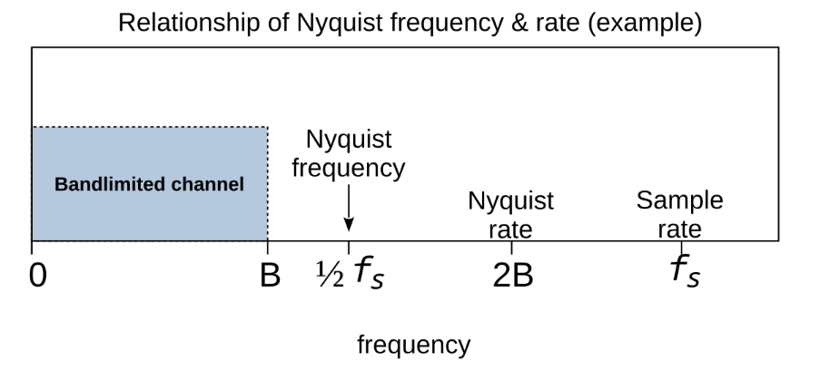
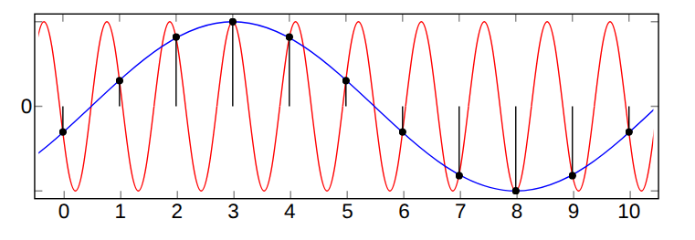
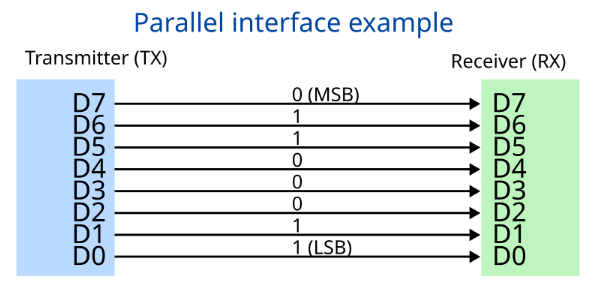
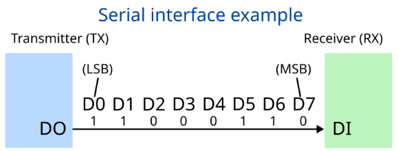
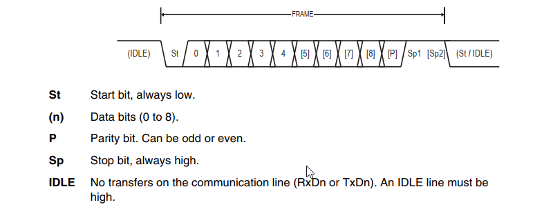
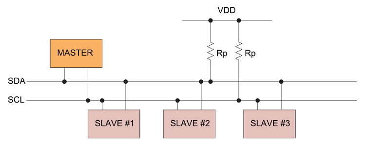

> Tags: I2C, SPI, UART, CAN, GPIO, DMA, ADC

# Reading for section 03: Peripherals and Protocols

**Goal:** Teach how to use the STM32 peripherals like the GPIO, ADC, Timers, and DMA, and communication protocols such as I2C and CAN.

In section 01, you were able to write firmware for an STM32 microcontroller to blink an onboard LED. In this section, you will learn more ways to blink that same LED and also learn to interface and communicate with external devices and peripherals.

---

## 1. General-Purpose Input/Output (GPIO)

**GPIO** stands for **General-Purpose Input/Output**. It is a digital pin on a microcontroller that you can control through firmware programming. GPIOs are important because they allow your microcontroller to interact with the physical world. With GPIO pins, you can do plenty of things such as reading sensors, communicating with other devices, and controlling LEDs, motors, and other high voltage devices.

With GPIO being a digital pin, it can be in one of two states:

- **HIGH** (3.3V)
- **LOW** (0V)

> Sometimes, development boards such as the Arduino will have HIGH as 5V, but the STM32 that you will be working with will use 3.3V as HIGH.

GPIOs can be programmed for various tasks. You can configure a GPIO to be either an:

- **Input**
  - Reading digital signals such as button presses
- **Output**
  - Sending digital signals out such as turning and LED on, or PWM signals


>You can also use GPIO inputs and outputs to emulate digital communication protocols using a technique known as [bit-banging](<https://en.wikipedia.org/wiki/Bit_banging>).


### Exercise 1: Using a Button to Turn On an LED
Navigate to ```WORK.md``` in this section and begin the first exercise.

### Using GPIO with Analog Signals


Although GPIOs are fundamentally digital pins, they can also be used to simulate analog inputs/outputs, being able to read or output voltages between LOW (0V) and HIGH (+3.3V). Microcontrollers use a technique known as **PWM**, or **Pulse-Width Modulation** in order to simulate an analog output.

PWM works by rapidly switching a GPIO pin HIGH and LOW at an extremely high frequency, creating a signal what looks like a square wave. By varying the **Duty Cycle**, or the percentage of the time the square wave is HIGH compared to when it is LOW, you can control the level of voltage as seen in the image below.


For example, if you wanted to output a GPIO pin at 1.65V, you would need a duty cycle of 50%. If you wanted an output of 0.825V, you would need a duty cycle of 25%. You can control these duty cycles using hardware timers, which we will demonstrate later in section 03.

A real world example of using PWM is for LED dimming, as LEDs require a minimum voltage applied to turn on. With PWM, you are able to keep the LED at that voltage level without having it turn off. The LED dims because it turns on and off at a fast rate that your eyes cannot percieve, creating the illusion of dimming. You can also use PWM in the same context for controlling motor speeds. 

### How to use PWM
Below are a couple of formulas you can use to calculate your desired voltage using PWM.

**Total Period (s)**

$$
\text{Total Period} = T_{\text{HIGH}} + T_{\text{LOW}}
$$

- $\text{Total Period}$ is the sum of how long the output is HIGH and how long it is LOW for one iteration
- $\text{T}_\text{HIGH}$ is the amount of time in seconds during the period when the output is HIGH
- $\text{T}_\text{LOW}$ is the amount of time in seconds during the period when the output is LOW

**<br>Duty Cycle (%):**

$$
\text{Duty Cycle} = \frac{T_{\text{HIGH}}}{\text{Total Period}} \times 100
$$

Where:
- $\text{Duty Cycle}$ is the percentage of time the signal is HIGH
- $\text{T}_\text{HIGH}$ is the amount of time in seconds during the period when the output is HIGH
- $\text{Total Period}$ is the sum of how long the output is HIGH and how long it is LOW for one iteration

**<br>Average Output Voltage:**

$$
V_{\text{out}} = V_{\text{HIGH}} \times \frac{\text{Duty Cycle}}{100}
$$

Where:
- $V_{\text{out}}$ is the average voltage output
- $V_{\text{HIGH}}$ is the logic HIGH voltage (3.3V)
- Duty Cycle is the percentage of time the signal is HIGH

## 2. Interrupts

An **Interrupt** is a signal that pauses the code that is currently running in order to execute another piece of code before resuming its previous task. Interrupts are extremely important in embedded systems as they offer an immediate response to time-critical events such as button presses, sensor and communication data, or indications of data buffers being full. 

### Types of Interrupts

There are two types of interrupts we will be looking at:
- **External**
- **Internal**

**External** interrupts are triggered by hardware outside of the microcontroller such as buttons, sensors, keyboards, or mice.

**Internal** interrupts are triggered by events inside of the microcontroller through peripherals such as timers, ADC completion, data buffers being full, or software events such as system calls. 

### How do Interrupts Work?

While the main program is running, an **IRQ** or **Interrupt Request** signal will be sent either internally or externally to alert the CPU. Upon receiving an IRQ, the processor will finish executing its current instruction, then pause the main program and save its current state. The processor will **handle** the interrupt by jumping to and executing an **ISR** or **Interrupt Service Routine**, which is a function designed to run upon an IRQ. After the ISR has completed, the program will resume the main program from its previous saved state.

### Polling Vs Interrupts

In [1. GPIO](#1-gpio) you were able to learn about how GPIOs can read digital signals from external peripherals such as buttons. Using this knowledge, if you wanted to read the input of a button to turn on an LED by constantly checking the state of the button in the main loop in a method known as **Polling**, which is what you did in [Exercise 1](#exercise-1-using-a-button-to-turn-on-an-led).

Polling can be very easy to implement and is easily understandable and able to be debugged, but it consumes CPU usage and power because it would constantly run in the background. Another disadvantage to polling is that it cannot handle time-critical tasks, and it may miss events if it is polling too slowly. 

>Another example: If you had an accelerometer sensor that outputs at a certain rate and you wanted to implement a [Kalman Filter](https://en.wikipedia.org/wiki/Kalman_filter), which requires the state of the system to be updated at a certain time rate, polling may update it too fast which could also it mess up. 

Interrupts can solve a lot of the issues mentioned above, but the disadvantages to using interrupts are that it can be harder to understand and debug, and introduce bugs if the ISR is written improperly. Using too many interrupts in a program can lead to even less efficiency because it can overwhelm the CPU, as it requires a lot of overhead to pause the main program, save its state and execute the ISR.

>You may have experienced your computer slowing down and opened up the Task Manager. You may have also come across a high usage of system interrupts leading to high CPU usage. This is an example of what can go wrong with interrupts.

This section went over a basic introduction to interrupts. You will learn more about interrupts in section-04.

### Exercise 2: Using Button Interrupts to Turn On an LED
Navigate to ```WORK.md``` in this section and begin the second exercise.

## 3. Timers
**Timers** are a hardware peripheral that count the number of clock ticks in order to generate precise timing intervals, which could be used to control pin timing, generate delays, and synchronize event timing.

> Circling back, PWM is a great example of how precise delays generated by timers can be used

Timers work by counting the number of clock pulses and resetting when hitting the max value based on the timer's bit resolution. For example, a 16-bit timer will count up (or down) starting from 0 and increment on every clock pulse until hitting 65535 and resetting. Upon reset, an interrupt signal is generated and will run whatever you put in its ISR.

You can measure how long a timer period is using the formula below.

$$
    \text{Timer Period} = \frac{{\text{Max Value}}}{\text{Bus Frequency}}
$$

For example, a 48MHz clock on the AHB Bus with a max value of 65535 will reset about every $1635 \mu s.$ 

### How to Control Timers

Timers can be programmed to run as fast or slow as the user wants. All timers are tied to a clock bus for peripherals that by default run at a very high rate. The bus clock can be slowed down specifically for a timer peripheral using a **Prescaler**, which divides the clock source in order to slow it down to whatever rate you need the timer to run at. The formula below shows how you will use it.

$$
    \text{Timer Frequency} = \frac{{\text{Bus Frequency}}}{\text{Prescaler Value - 1}}
$$

>Note: For the STM32, it is important to subtract 1 from the desired value of the prescaler as it is how they are designed to work.

For example, if I wanted a timer that operates at 48kHz, I would enter a prescalar value of 1000. 

If you wanted to manually set the max value, you could also use the **ARR** or **Auto-Reload Register**, which allows you to set up the max counter value. If you wanted the clock to stop at 32768, the ARR will allow you do do that.

Putting it all together, the formula for setting your desired timer frequency will look like this.

$$
    \text{Timer Frequency} = \frac{{\text{Bus Frequency}}}{\text{(Prescaler Value - 1)} * \text{(ARR Value - 1)}}
$$

## 4. Analog-to-Digital Converters (ADC)

An **Analog-to-Digital Converter** or **ADC** is a peripheral that converts an analog signal, such as a voltage into a digital format that the microcontroller can use. Every ADC works by sampling a signal discretely at a given rate. and converting it to a digital format in a process known as **Quantization**.  

On the STM32, the ADC works using a **Successive Approximation Register** or **SAR**. The ADC will sample and hold the input voltage signal, and compare the sampled voltage to set internal voltage references using a binary search. To control the sampling rate, hardware timers are attached to the ADC and configured for it to sample at any given rate the user wants.  

### Nyquist-Shannon Sampling Theorem

When using an ADC, it is important to know the **Nyquist-Shannon Sampling Theorem**, which states that for any continuous-time signal, you would need to sample at a rate at least 2-times higher than its highest frequency component. This would mean if the highest frequency signal you are expecting to sample is 6kHz, you will need the ADC to sample at 12kHz at the minimum.



If an ADC is sampling at 12kHz, the ADC will only be able to read up to 6kHz, which will be your **Nyquist Frequency**, which is represented as 1/2 your sampling rate. Any signals with frequencies above the Nyquist Frequency will be reconstructed poorly and get mixed into your main signal in what is known as **Aliasing**. An example of this can be seen below.



>You will learn more about analog and digital signal processing and how to prevent aliasing in section-05. 

### Converting ADC Values to a Voltage

When using the ADC, you will get a value from $0$ to $2^N-1$, with $N$ being the resolution in the number of bits of the ADC. To convert this number into a voltage of type float or double, you would need to use the formula below.

$$
V = \frac{\text{ADC Value}}{2^N - 1} * V_\text{REF}
$$

Where:
- $V$ is the measured voltage
- $\text{ADC Value}$ is the digital value read from the ADC
- $N$ is the ADC resolution in bits
- $V_{\text{REF}}$ is the reference voltage for the ADC (3.3V on STM32)

For example, if you have a 12-bit ADC ($N = 12$), a reference voltage of $3.3V$, and the ADC reads a value of $2048$:

$$
V = \frac{2048}{4095} * 3.3V \approx 1.65V
$$


## 5. Direct Memory Access (DMA)
Normally, having a peripheral accessing memory requires the CPU to handle every single transaction. With high speed data streams such as ADCs sampling thousands, maybe even millions of times per second, these operations can quickly bog down the CPU. Luckily, there exists a solution to offload these data transfer operations so that the CPU can focus on other tasks. 

**Direct Memory Access**, or **DMA** is a feature that allows a peripheral to interface directly with memory with minimal intervention from the CPU. A DMA controller is used to automatically move data from the peripheral to memory while the CPU is free to do other tasks in the background. DMA is especially useful for moving large streams of data to memory in an efficient manner.


> External DMA cards have become a popular method used for undetected cheating in video games. DMA allows a player to read the memory of the system directly, bypassing all checks from the CPU and anti-cheat software.


### How to Use DMA

The DMA controller is set up with a data buffer for the peripheral data to be stored and later transferred. Upon completion, the DMA controller will fire an interrupt to signal that the buffer is filled. You can then use the provided interrupt handler to process the recently transferred data from the peripheral however you want. 

On most microcontrollers including the STM32, The DMA controller will fire interrupts when the DMA buffer are both half-filled and completely filled. Knowing this, you can double the buffer size and process one half of the data while the other half fills in a process known as **Double-Buffering** or a **Ping-Pong Buffer**.

### Exercise 3: Reading Analog Voltages with the ADC using DMA
Navigate to ```WORK.md``` in this section and begin the third exercise.

## 6. Communication Protocols
In order for microcontrollers and other devices to exchange information and communicate with each other, the devices must agree to set of techniques and guidelines in what is known as a **Communication Protocol**. 

Communication protocols can be broken down into two different types:

- **Parallel**
- **Serial**

### Parallel Communication

**Parallel Communication** transmits bits of data over several lines simultaneously. Although it comes with an increased cost due to the number of connections required, it has a massive advantage when it comes to simplicity and speed of data transfers over short distances. Parallel communication is commonly seen in internal buses like RAM and CPU connections, peripheral buses such as PCI connections, and display connections such as RGB-TTL. 




### Serial Communication

**Serial Communication** transmits bits of data one-by-one sequentially over a bus. In contrast to parallel communication, serial communication often requires less wires and some, not all protocols tend to maintain better signal integrity over longer distances than parallel communication. Modern advancements in technology have made serial communication faster, making it a highly preferred choice of communication. Common examples of serial communication are in peripheral buses such as PCIe, USB, SATA. Common serial protocols include UART, I2C, SPI, CAN, RS-232, and Ethernet.

In order for serial communication to work effectively, each device must agree on a data rate. This can be done in two different ways:

 - **Asynchronous**
 - **Synchronous** 

In **Asynchronous** communication, the devices maintain their own clocks, but use a mutually agreed-upon data rate to send and receive bits independently.

In **Synchronous** communication, a clock signal is shared between the devices.



For the remainder of section-03, we will be discussing four commonly used communication protocols you will be using during your time in Dallas Formula Racing.


## 7. Universal Asynchronous Receiver/Transmitter (UART)

**Universal Asynchronous Receiver/Transmitter** or **UART** is an example of asynchronous serial communication. where the two devices do not share a clock signal, but agree on a specified data rate for communication. It is widely adopted because it is an extremely simple protocol to implement and understand, and you will often see it as the method for logging data over a serial port. Despite its simplicity, data frame size is limited and usually only carrying 8-bits in a frame, and long distance communication is not viable. 

UART requires two wires to commmunicate with each other:
- **TX** (Transmitter)
- **RX** (Receiver)

The TX goes into the other device's RX and vice versa. Both devices must also share a common ground.


### UART Data Frame

Since UART is asynchronous, both devices need to agree on a certain **Baud Rate**, or number of bits sent per second. Common baud rates you will see in UART are **9600, 19200, 38400, 57600, 115200, 230400, 460800, and 921600**.

Process of a UART Transmission:

1. In UART, the message will be sent from TX to RX. 

2. A UART frame starts and stays in HIGH to indicate an **Idle** state. 

3. To begin the transmission, the data line will be pulled LOW, indicating the **Start Bit**. 

4. After the start bit, 8 bits will be sent with the LSB first, and MSB last. Sometimes you may even encounter a **Parity Bit** in order to check to see if the data transmission is coherent. 

5. To end the transmission, the data line gets pulled back up to HIGH to indicate the end of the transmission. 



## 8. Serial Peripheral Interface (SPI)
**Serial Peripheral Interface**, or **SPI** is another common way of communication between devices and protocols. It offers a drastic advantage when it comes to data transmission rates, sometimes up to 10 MHz or higher as it is synchronized by a clock, and does not need extra overhead of checking for parity or start/stop bits. The downsides to using SPI is that it is not a viable form of long distance communication, and you would need to accomodate pins in order to support more devices.

SPI communicates between a **Master** and one or more **Slave** devices. Essentially, the master device will send a command to a slave device, which the slave will them respond with sending data back to the master. SPI typically operates in a **Full-Duplex** mode, which means that data is both simutaneously sent and received between devices using multiple data lines. SPI also allows for multiple devices to be connected in a daisy-chain fashion to communicate with each other. Every slave device requires its own **Chip Select**, or **CS** line connected to the master device, which is important to consider when using SPI.


Altogether, SPI requires 4 wires to communicate:
- **CS** (Chip Select)
- **MISO** (Master-In Slave-Out)
- **MOSI** (Master-Out Slave-In)
- **CLK** (Clock)

> Since SPI is not standardized, you will often see terms being changed. Sometimes you will see MOSI and MISO being named SDI and SDO, but the function of the pins remain the same.

When working with SPI, it is important to know that SPI has different **Modes** designated by **CPOL**, or **Clock-Polarity** and **CPHA**, or **Clock Phase**. CPOL indicates whether the clock will idle on a LOW or HIGH clock, and CPHA indicates whether the data is sampled on the rising or falling edge of a clock. 

The SPI modes are listed below: 
- **MODE 0**: Idles LOW, Data sampled on the rising edge
    - CPOL: 0
    - CPHA: 0
- **MODE 1**: Idles LOW, Data sampled on the falling edge
    - CPOL: 0
    - CPHA: 1
- **MODE 2**: Idles HIGH, Data sampled on the falling edge
    - CPOL: 1
    - CPHA: 0
- **MODE 3**: Idles HIGH, Data sampled on the rising edge
    - CPOL: 1
    - CPHA: 1

### SPI Data Frame
The process of an SPI transmission:

1. To start an SPI transmission, the master device will pull the CS line LOW for the slave device it wants to communicate with. 

2. The master will generate the CLK pulses to synchronize the slave. 

3. The master device will then send 1 byte of data over the MOSI line to the slave.

4. The slave device will then send 1 byte back over the MISO line.

Below is an example of a clock diagram for SPI MODE 0.


## 9. Inter-Integrated Circuit (I2C)
**Inter-Integrated Circuit**, or **I2C** is another form of synchronous serial communication. I2C is primarily used for short-distance communication, originally purposed for communicating between integrated circuits on a PCB. I2C is very common with microcontroller peripherals due to it only requiring 2 wires and allows for devices to be daisy-chained. However, it is significantly slower than SPI, often capping out at 400kHz, and needs resistors to pull up the data line in order for it to function. 

Like SPI, I2C uses a Master-Slave device configuration. I2C also supports daisy-chaining, with the benefit of not needing extra wires and pins for slave selection. However, I2C differs from SPI in that it operates in a **Half-Duplex** mode, which means that the master and slave data is sequentially sent over one data line, and only one device can communicate at a time.

I2C requires 2 wires:
- **SCL** (Serial Clock)
- **SDA** (Serial Data)

The **SCL** line provides the clock signal to synchronize the devices, and the **SDA** line is used to transfer data across devices.



The necessity of the resistors **Rp** will be explained next.

### Open Drain Design

I2C is designed in a fashion that the master device can only pull the clock and data lines LOW. In what is known as an **Open-Drain** output, an nMOS transistor is connected in a way that will short the line to LOW when voltage is applied to the gate. However, there is no way to pull the line back up to HIGH when the gate voltage is LOW. In order to pull the line back up, **Pull-Up Resistors** connect the line to HIGH. The resistance values for the pull-up resistors are often 10 kΩ, 4.7 kΩ, or 2.2 kΩ depending on the speed and capacitance of the bus. 


### I2C Data Frame

The process of an I2C transmission:

1. For the **Start Condition**, the master will begin the communication by setting SDA to LOW when the SCL is HIGH in order to wake up the slave devices. 

2. A 7-bit **Address** is then sent over SDA in order to identify the slave device that will be communicating the master device. 

3. A singular **Read/Write Bit** is sent over SDA signifying a
    - 0: Write Operation
    - 1: Read Operation

4. Data is sent over SDA 1 byte at a time. 

5. In between bytes, an **ACK** or **Acknowledge** bit is sent over SDA for both devices to confirm that the data byte was transmitted successfully.

6. The master device will end the communication by allowing the pull-up resistor on SDA to get pulled back to HIGH in what is known as the **Stop Condition**.


## 10. CAN and CAN-FD

**CAN** stands for **Controller Area Network**. Its a 2-wire communication bus commonly used in automotive and industrial applications. Theres 3 layers to understading CAN: the 2 wire bus where nodes connect and communicate, the microcontroller/transciever interface, and the CAN message/frame (the actual data, and what it looks like to send a CAN message).

### 1a. The Two Wire Bus

CAN works like a group chat. Instead of having a master/slave to each node on the bus, theres a CAN_H and CAN_L line on which every node shouts its messages. Some nodes only read messages and dont send any, some send and receive, but regardless, all nodes on the same bus see eachothers messages. At the ends of the 2 wires are 120ohm termination resistors. Heres an example:


Its important to know what CAN_H and CAN_L are. CAN_H or CAN High ranges from 2.6v-5v, and is differential with CAN_L or CAN Low, which ranges from 0-2.6v . Like any digital message, data is sent in bits. When sending a "0", CAN_H and CAN_L are equal at ~2.6v. When sending a "1", CAN_H goes up to 5v and CAN_L goes down to 0v. When CAN_H increases, CAN_L decreases an equal amount. 


This is what "differential" means. The excited state is interpreted by the difference in CAN_H and CAN_L. So sending a bit on a CAN line consists of increasing the difference between CAN_H and CAN_L.

Why? CAN uses a twisted pair of wires it communicated on, and this in combination with differential signaling, means CAN is extremely resilient to noise.

## 1b. MCU Integration

Just like some microcontrollers may have SPI or UART pins, certain mcu's have a CAN core/CAN peripheral that are assigned CAN_TX and CAN_RX pins. Notice its not CAN_H and CAN_L. Microcontrollers do not directly connect to the CAN lines **EVER**, instead, their CAN_TX and CAN_RX are connected to a **CAN TRANCEIVER** which converts from TX/RX to CAN_H/CAN_L. CAN_TX is for sending messages, and CAN_RX is for receiving messages.


So on a PCB that uses CAN you will see: MCU --CANTX/RX---> CAN Transceiver --CANH/L---> CAN Line

Without getting too much into the hardware side, thats bascially all there is to CAN physically. Now we know how sending a bit works starting at the microcontroller. The beautiful thing about CAN is that you dont need a centralized connection to a switch like ethernet or other peripherals, instead you just have the distributed nodes. This allows for unique applications like daisy chaining that otherwise wouldnt be easily implemented.

### 1c. The CAN frame
Now, due to multiple nodes communicating on the same 2 wires, CAN messages have specific formatting that make sure we can actually send and receive messages without getting interrupted by other nodes trying to send a message at the same time and making a jumbled mess. To solve this we use **arbitration**
"CAN arbitration" refers to the non-destructive process on a Controller Area Network (CAN) bus that prevents data corruption when multiple devices attempt to send messages simultaneously. It works by comparing message identifiers, where a lower identifier number indicates a higher priority. The device transmitting the message with the highest priority (lowest ID) takes control of the bus, while other devices with lower-priority messages suspend their transmission and wait for the bus to become free again.
 
#### How CAN Arbitration Works

1. **Simultaneous Transmission Attempt:**
When multiple nodes on the CAN bus detect an idle bus and try to send a message at the same time, a potential conflict arises. 

2. **Dominant and Recessive Bits:**
The process relies on "dominant" (logic 0) and "recessive" (logic 1) bits. When a node transmits a recessive bit but senses a dominant bit on the bus from another node, it knows it has lost the "battle" for the bus. 

3. **Bitwise Comparison:**
Each transmitting node monitors the bus while it sends its message identifier. 

4. **Priority Determines Winner:**
The node that transmits a dominant bit at an earlier position in the identifier "wins" arbitration, taking control of the bus. 

5. **Suspension and Retransmission:**
The nodes that transmitted a recessive bit and lost arbitration immediately stop transmitting and wait for the bus to become idle again to try and retransmit. 

6. **Non-Destructive and Loss-Free:**
Because the high-priority message is never lost or corrupted and continues uninterrupted, the process is both non-destructive and ensures no data is lost. 

#### Features:

- **High-Priority Access:**
The device with the highest priority message (lowest ID) gets immediate access to the bus. 

- **Automatic Process:**
The arbitration process is handled automatically by the CAN controllers in each node. 

- **Guaranteed Bandwidth:**
Arbitration ensures that bandwidth is not compromised by message collisions. 

- **Real-time Priority:**
Message priority is allocated in real-time, making the CAN bus efficient for time-critical applications


The arbitration, message id, and header, combined with the actual data of the CAN message together is called a CAN Frame


This is where the actual difference between CAN and CAN-FD comes into play. CAN-FD (Flexible Data-rate) can specify how many bytes the message is going to be in its frame header, and can have up to 64 bytes of data per CAN frame/message. Normal CAN is maxed at 8 bytes and always sends 8 bytes. With normal CAN you can get bandwidth of up to 1mbit/sec whereas CAN-FD can get 5mbit/sec and even up to 8 with the right hardware. In DFR, we are moving to CAN-FD, as it is replacing standard CAN